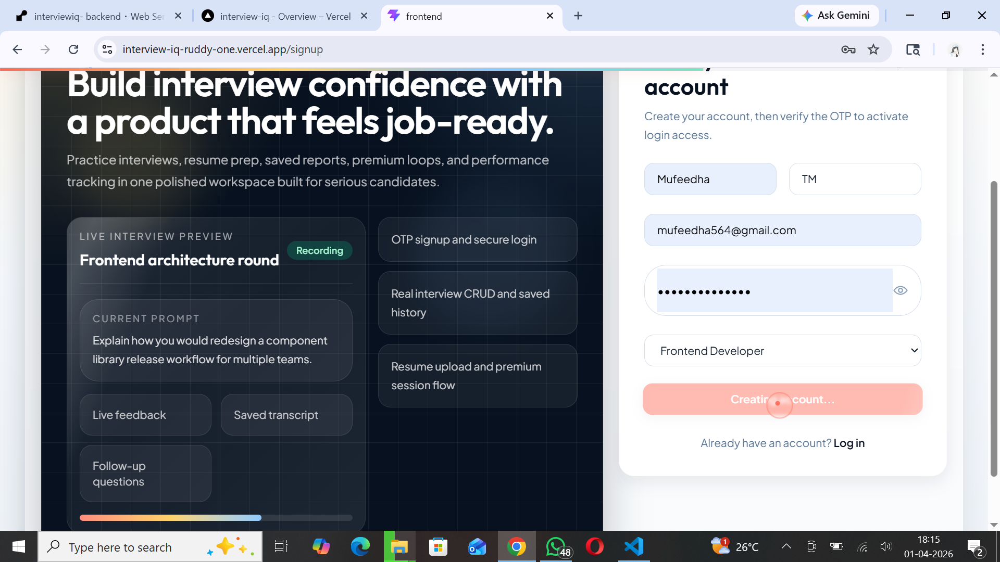
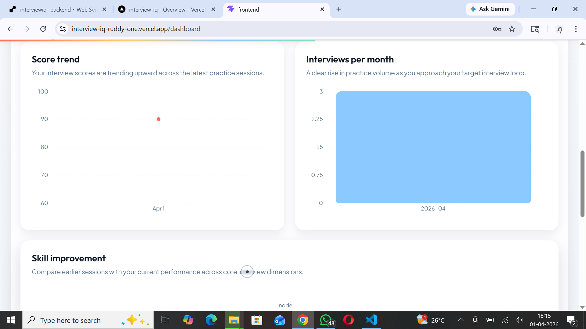
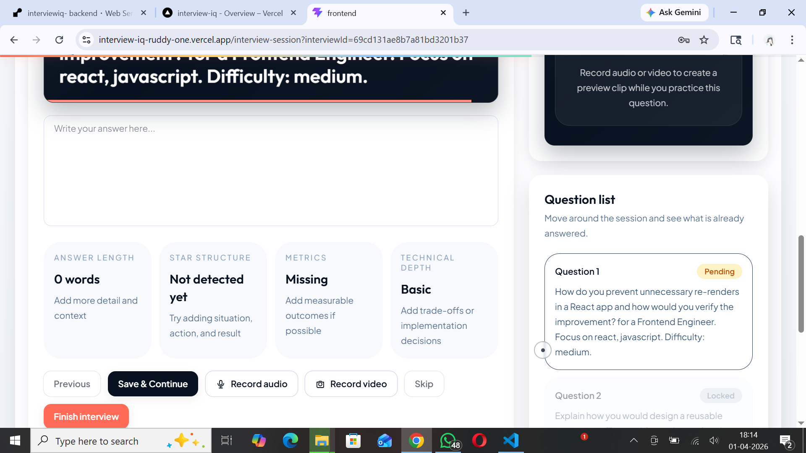
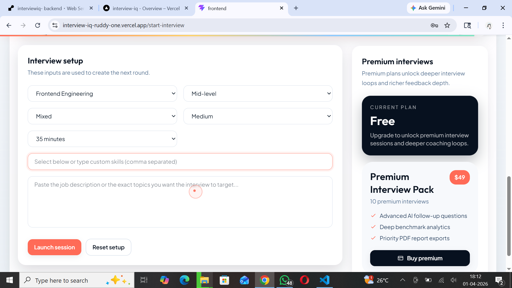

# InterviewIQ - MERN Stack Final Project

InterviewIQ is a full-stack MERN application for interview preparation. It covers secure auth, OTP/email flows, CRUD operations, search/filter, uploads, analytics reports, and premium checkout.

## 1) Project Objective Coverage

### Mandatory
- Secure authentication and user management (JWT + bcrypt)
- OTP verification and email integration
- Forgot/reset/change password
- CRUD operations with REST APIs
- Search and filter
- Image/file upload (Multer + Cloudinary / local fallback)
- Aggregation and reporting
- Multi-collection joins (`$lookup`)
- Responsive React frontend with reusable components
- Toast notifications for success/error

### Bonus Implemented
- Stripe checkout integration
- Charts/graphs with Recharts
- Dark mode theme toggle
- Report export (PDF + Excel-compatible CSV + JSON)

## 2) Tech Stack
- MongoDB (Mongoose)
- Express.js + Node.js
- React + Vite
- Tailwind CSS
- Axios
- React Router
- React Toastify
- Stripe
- Recharts

## 3) Folder Structure

```text
interviewiq/
  backend/
    src/
      config/
      controllers/
      middleware/
      models/
      routes/
      services/
      utils/
      app.js
      server.js
  frontend/
    src/
      components/
      context/
      pages/
      services/
      utils/
      App.jsx
      main.jsx
```

## 4) Environment Variables

### Backend (`backend/.env`)

```env
NODE_ENV=development
PORT=4000
CLIENT_URL=http://localhost:5173
OTP_EMAIL_TIMEOUT_MS=20000
MONGODB_URI=<your_mongodb_connection_string>

JWT_SECRET=<long_random_secret>
JWT_EXPIRES_IN=15m
JWT_REFRESH_SECRET=<different_long_random_secret>
JWT_REFRESH_EXPIRES_IN=7d

EMAIL_HOST=smtp.example.com
EMAIL_PORT=587
EMAIL_USERNAME=<smtp_username>
EMAIL_PASSWORD=<smtp_password>
# optional aliases supported:
# EMAIL_USER / EMAIL_PASS

CLOUDINARY_CLOUD_NAME=<cloud_name>
CLOUDINARY_API_KEY=<api_key>
CLOUDINARY_API_SECRET=<api_secret>

STRIPE_SECRET_KEY=sk_test_...
STRIPE_WEBHOOK_SECRET=whsec_...
```

Note:
- In development, if SMTP values are missing, the app falls back to a Nodemailer test mailbox.
- In production, SMTP is mandatory and the app will reject email operations without full SMTP config.
- `OTP_EMAIL_TIMEOUT_MS` limits how long signup / verify / forgot-password OTP mail requests can block the response when SMTP is slow.

### Frontend (`frontend/.env`)

```env
VITE_API_BASE_URL=http://localhost:4000/api
VITE_STRIPE_PUBLISHABLE_KEY=pk_test_...
```

## 5) Run Locally

### Backend

```bash
cd backend
npm install
npm run dev
```

### Frontend

```bash
cd frontend
npm install
npm run dev
```

## 6) Stripe Webhook (Local)

```bash
stripe login
stripe listen --forward-to localhost:4000/api/payments/webhook
```

Copy the printed `whsec_...` to `STRIPE_WEBHOOK_SECRET` in `backend/.env`.

## 7) Deployment

Fill these when deployed:

- Frontend URL (Vercel/Netlify): `https://<your-frontend-url>`
- Backend URL (Render/Railway): `https://<your-backend-url>`
- MongoDB Atlas cluster: `<cluster-name-or-connection-proof>`

Recommended production variables:

### Backend host

```env
NODE_ENV=production
PORT=4000
CLIENT_URL=https://<your-frontend-url>
OTP_EMAIL_TIMEOUT_MS=20000
MONGODB_URI=<your_mongodb_connection_string>
JWT_SECRET=<long_random_secret>
JWT_EXPIRES_IN=15m
JWT_REFRESH_SECRET=<different_long_random_secret>
JWT_REFRESH_EXPIRES_IN=7d
EMAIL_HOST=smtp.gmail.com
EMAIL_PORT=587
EMAIL_USERNAME=<your_gmail_address>
EMAIL_PASSWORD=<your_gmail_app_password>
CLOUDINARY_CLOUD_NAME=<cloud_name>
CLOUDINARY_API_KEY=<api_key>
CLOUDINARY_API_SECRET=<api_secret>
STRIPE_SECRET_KEY=sk_live_or_test_...
STRIPE_WEBHOOK_SECRET=whsec_...
```

### Frontend host

```env
VITE_API_BASE_URL=https://<your-backend-url>/api
VITE_STRIPE_PUBLISHABLE_KEY=pk_live_or_test_...
```

Deployment checklist:

1. Push the latest code to GitHub.
2. Redeploy the backend first so auth/email route changes go live before the frontend points to them.
3. Confirm the frontend `VITE_API_BASE_URL` points to the deployed backend `/api` URL.
4. Confirm backend `CLIENT_URL` exactly matches the deployed frontend origin.
5. Do not commit real `.env` files to GitHub. Commit only `.env.example`.
6. If secrets were already committed, rotate MongoDB, Gmail, Cloudinary, Stripe, and JWT secrets before redeploying.

## 8) Submission Checklist

### Frontend

| Requirement | Status |
|---|---|
| Responsive Design | Done |
| Reusable Components | Done |
| React Hooks | Done |
| Context API / Redux | Done (Context API) |
| Routing (React Router) | Done |
| API Integration (Axios) | Done |
| Toast / Alerts | Done |

### Backend

| Requirement | Status |
|---|---|
| User Authentication (JWT) | Done |
| OTP & Email Verification | Done |
| Forgot / Change Password | Done |
| CRUD Operations | Done |
| Search & Filter | Done |
| Image Upload | Done |
| Aggregation / Reports | Done |
| Join (Multiple Collections) | Done |

### Deployment & Docs

| Requirement | Status |
|---|---|
| Frontend Hosted | Pending (add URL) |
| Backend Hosted | Pending (add URL) |
| MongoDB Atlas Connected | Pending (add proof/link) |
| GitHub Repo Link | Pending (add repo URL) |
| README with Screenshots | Pending (add screenshots below) |
| Demo Video (2-3 min) | Pending (add link below) |

### Bonus

| Feature | Status |
|---|---|
| Payment Integration (Stripe) | Done |
| Charts / Graphs | Done |
| Dark Mode | Done |
| Export Reports | Done (PDF + CSV + JSON) |

## 9) Screenshots

Add your screenshots here:

```md




```

## 10) Demo Video

Add your demo video link:

`https://<your-demo-video-link>`
